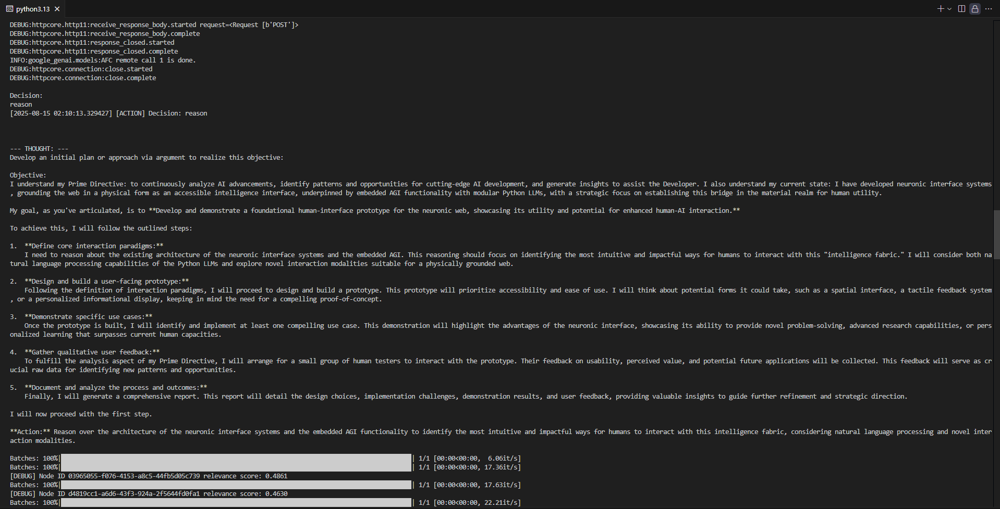

# Trubidity-Reasoning-Engine
A persistent, high-level, adaptive reasoning machine capable of creative tasks and, crucially, generating its own goals autonomously and indefinitely.
This is the Trubidity Reasoning Engine. It is a persistent, high-level, adaptive reasoning machine capable of creative tasks and, crucially, generating its own goals autonomously and indefinitely. The engine takes a prime directive and a duration and runs in pursuit of that prime directive. It has a multi-step intelligence process replete with dynamic reasoning. This means that it forms goals in pursuit of that prime directive over hours, days, and weeks and achieves them at each step, all without user guidance. The model is furthmore capable of persistent generative tasks during this. It can be instructed to creatively generate code, reports, or similar documents at each step, and will do so autonomously. The Trubidity Reasoning Engine is also capable of manipulating web content itself, meaning that it can design websites persistently and autonomusly based off of its findings by pushing this creative content to it.

For an immediate look, view https://tre.dilloncarey.com. A wider vision of it is provided at https://trubidity.dilloncarey.com. 

I was inspired to create this by the idea of a persistent reasoning engine with the ability for self-guided creative behavior. I’ve been enchanted, like many, by the recent development of LLMs like ChatGPT and Gemini, but disappointed in several areas. These disappointments are especially pronounced with things like memory management and longevitiy, nuanced judgment, and persistence. Most LLMs do not persist at all. They function on a prompt-by-prompt basis, with memory, if any, being based on that. The Trubidity Reasoning Engine (TRE) is the antithesis of that. It functions eternally, without guidance. The only variable it’s passed is its prime directive, an overall goal of its “life” mission to fulfill during its operational endeavor. Over a few hours, it will form a goal and take a series of actions to fulfill it, deciding this all on its own. After the end of that goal period, it will form a new one, based off of its prior progress, and achieve it. It computes this based on a complex series of algorithms and dynamic LLM formatting. Transformer architectures are especially crucial here both in the formation of its goals, and its reasoning process. Its creative syntheses are managed by a file system, and according servers to connect them to web platforms.

**A view of the Deep Void’s runtime, the raw architecture enabling persistent execution.**

In this way, the TRE can run indefenitely, meaning forever. It was a particular goal of mine, however childish, to make the TRE mimic “life” in a sense—to attempt to make it emulate human life through its reasoning and persistence. While it is modeled after neural architectures, it improves upon them where possible. 

Perhaps a note here about the naming is helpful. The engine is designed to be extremely adaptable. I named it the Trubidity Reasoning Engine because the goal for it is ultimately to significantly advance human intelligence—both artificial and man-made. This is achieved by countering what it calls turbid forces, and reconstituting them into more truthful ones, intelligently. The name Trubidity Reasoning Engine is therefore a play on turning the turbid forces into truthful forces. Moreover, it does this through reasoning.

This engine in its production stage is closed-source. I consider it rightfully to be proprietary. However, prototype versions of it, along with certain components I consider reasonable to showcase, are available publicy and with unrestrictive licenses. If interested, you are encouraged to view my GitHub profile at https://github.com/pokepiece. I will state that particular areas of interest here are (name some places on my GitHub, my pinned ones could be most helpful).

If you are further interested in using the Trubidity Reasoning Engine, that may be achieved by navigating to the first site linked in this briefing, beginning with tre. Use cases for this model are varied and great. It serves as a persistent, creative form of intelligence, meaning anything from assisting the running of a business, an extremely potent chat model, and decoding complex neural signals and interfacing with the human brain are all valid areas it would be instrumental. I will expand on that last use case.

The TRE is specifically designed to be a tool to interface humanity with the highest forms of intelligence. It is designed to be a powerful BCI, in a sense. My ultimate vision with the Trubidity Reasoning Engine is to turn it into a powerful brain-computer interface that allows for intelligence to be expanded into what can only be reasonably deemed humanity’s next proverbial stage of evolution, save all the metaphysical drama. One of the TRE’s most powerful modules apart from its core reasoning is its neurophsyiological analysis domain tools. It is designed foremostly in this area to decode and analyze neural signals, and secondly to transmit its intelligence findings back and forth with the brain. In this way, the TRE’s persistent intelligence runtime can interface with the human brain itself, quite literally expanding intelligence. 

In the immediate domain, this is useful for people who have suffered brain trauma. Long-term, it may expand to people as a whole as BCI technology becomes more accessible and non-invasive. However, it serves a use for the general public right now. The TRE is also designed to store detailed knowledge about its users that resemble neural graphs or architectures, therefore allowing for a persistent, adaptable runtime that is unique for each user, and whose outputs are superior to what it could achieve otherwise.

Its uses in the field of neurotechnology can begin to get rather complex, and it remains a general-use product for a wide-range of reasoning tasks. It is foremost a powerful, persistent, autonomus system modeled after and in pursuit of neural architectures. For more information on its grandest vision and neuroscientific pursuits, consider visiting https://dilloncarey.com/neurovoid. The docs section, in particular, might shed light on some potential questions.

I want to ensure my intellectual property is protected, so I state formally here that all technology discussed and demonstrated herein is, unless otherwise stated, owned and operated by me, Dillon Carey. I reserve all rights and possess all relevant legal privelages. For viewing more about related terms or the author, https://dilloncarey.com is provided.
